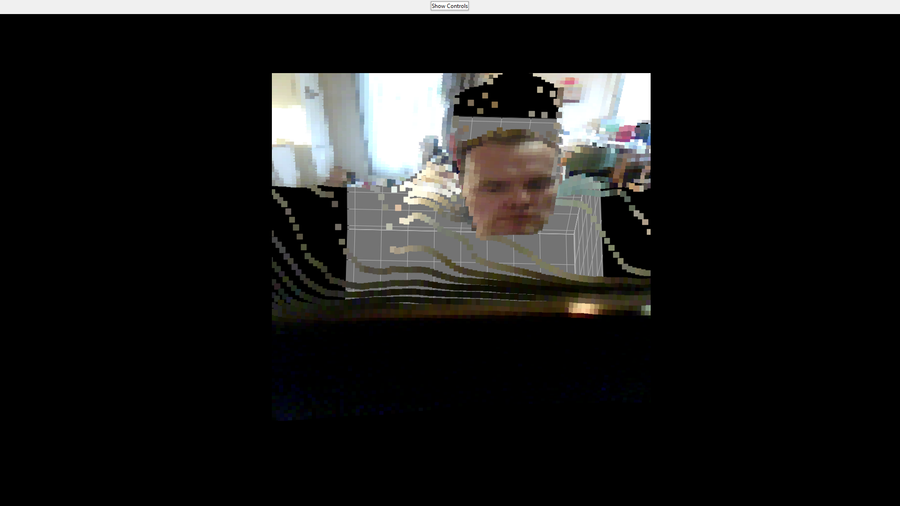

# Depth Blocks 

This is a simple Python application that uses Tkinter and Matplotlib to visualize a live depth map generated by the MiDaS model. You can use either a webcam or a video file as your input source. The application provides controls to adjust various parameters such as downsample step, block size, blur sigma, zoom, background color, and playback options.

## Features

- **Input Source:** Webcam or video file.
- **Resolution:** Choose from a set of predefined resolutions.
- **Fullscreen Toggle:** Easily switch to fullscreen mode.
- **Adjustable Controls:** Modify downsample step, block size, blur sigma, and zoom using sliders.
- **Background Toggle:** Switch between a black and white background.
- **Playback Controls:** Play/Pause and Loop for video playback.
- **Control Panel Toggle:** Hide or show the control panel.

## Requirements

- Python 3.x
- [OpenCV](https://pypi.org/project/opencv-python/)
- [NumPy](https://pypi.org/project/numpy/)
- [PyTorch](https://pypi.org/project/torch/)
- [Matplotlib](https://pypi.org/project/matplotlib/)
- [SciPy](https://pypi.org/project/scipy/)

## Installation

1. **Clone or Download the Repository:**

   Clone this repository or simply download the script file.

2. **Install Dependencies:**

   Use pip to install the required packages:
   
   pip install -r requirements.txt

# Usage

Run the application with Python:

python app.py

Use the control panel to switch between input sources and adjust the display settings as needed.

# Notes

The app uses the small version of the MiDaS model from intel-isl/MiDaS via Torch Hub.

On Windows, the video capture backend is set to cv2.CAP_DSHOW for compatibility.

# License

This project is licensed under the MIT License.
